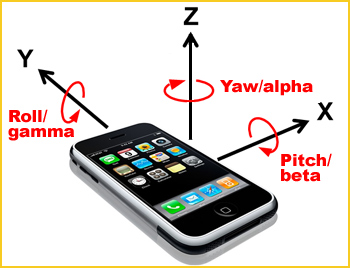
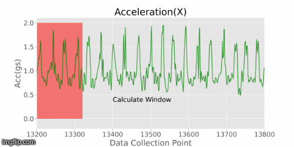
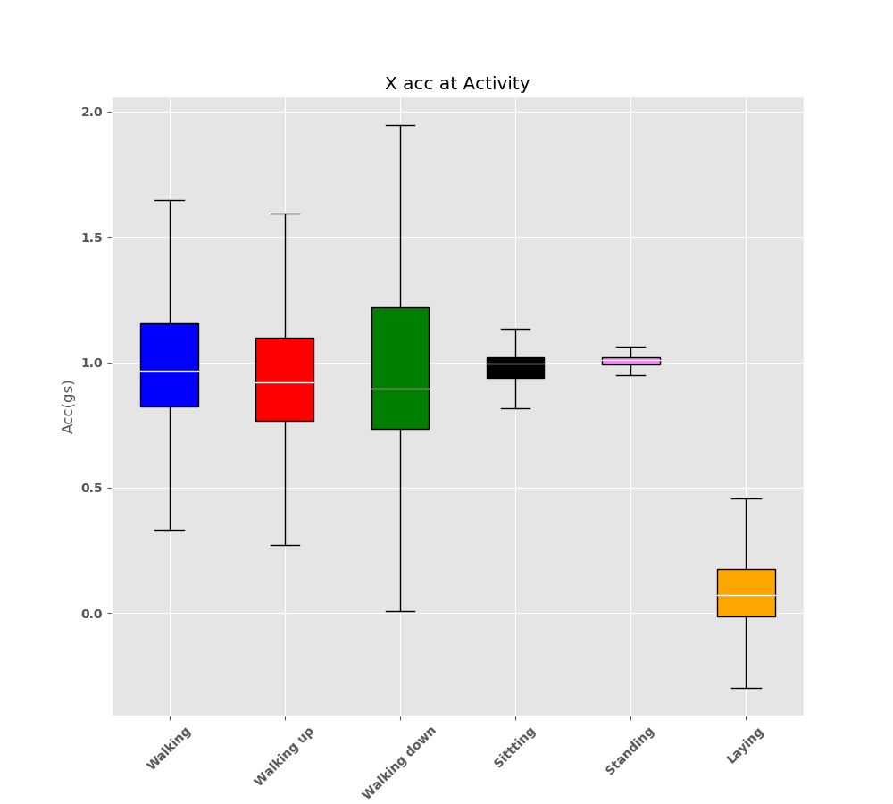
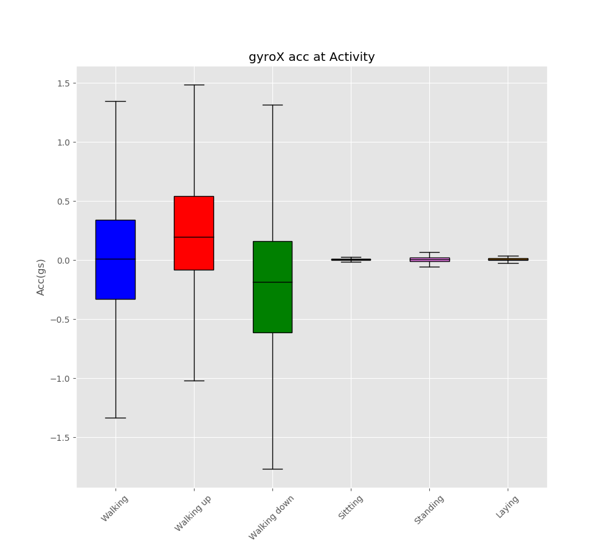
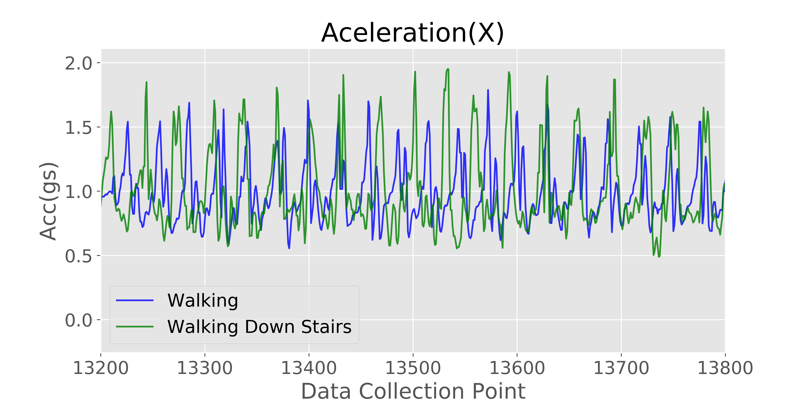
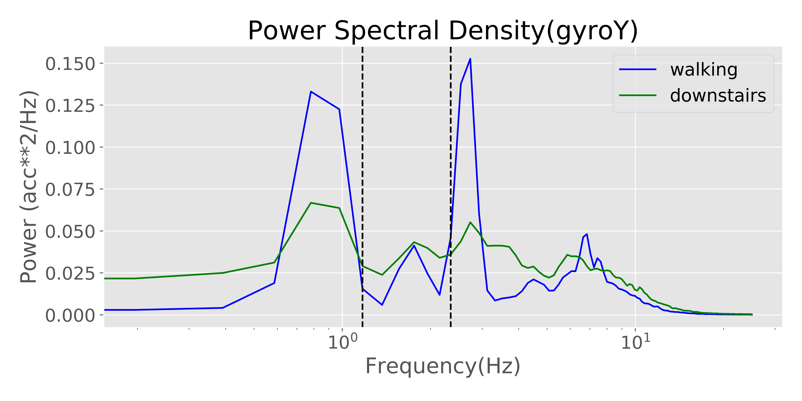
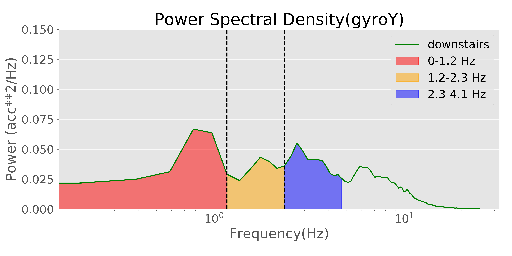
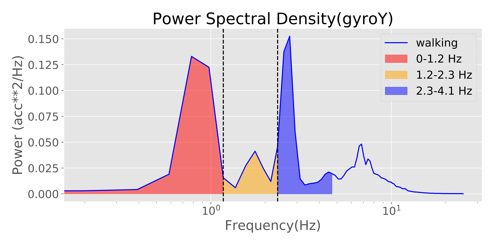
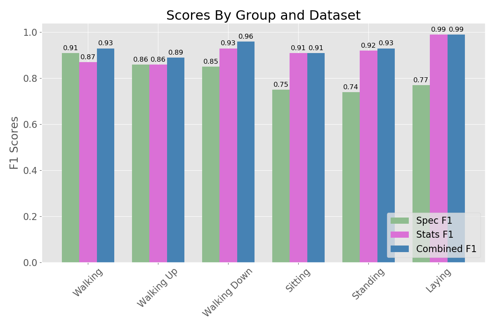

# Human Activity Recognition
## Background
The modern-day smartphone is a pretty incredible piece of equipment that is fitted with a wide range of sophisticated measurement sensors. When it comes to sensor data, there are many tools available to analyze that data. Being formally trained as an engineer, when I see acceleration data, I might take a different approach than a typical Data Scientist and in this project, I want to show the advantages that might hold. This project uses a UCI data repository of smartphone data to label an activity the activities are outlined below, and I will show how a model can be improved by implementing power spectral density analysis with statistics; can aid in the classifying of human activity. 
1. Walking           
2. Walking Upstairs  
3. Walking Downstairs
4. Sitting           
5. Standing          
6. Laying    
## The Data
Each row of data contained acceleration in the X, Y, and Z direction as well as angular accelerations about XYZ, from a Samsung Galaxy SII internal accelerometer and gyroscope. The data was collected at 50 Hz (50 times a second) for 30 subjects doing the previous 6 activities. Each experiment lasted approximately 15 minutes and the data was manually labeled. This led to 1122773 rows of data.

Note: The orientation of the phone was kept the same during all experiments but it is unclear in the data set which direction the XYZ axis were in relation to the phone. These pictures help as a contextual understanding of the acceleration directions but should not be used as an actual interpretation.

  

## Data Prep

I prepared 3 data sets to train a model on by taking subsamples of my original dataset, to avoid problems in calculating the spectral density calculations and in practice it makes more sense to get a subset of the data. The data was broken up by participants and activity and I took 120 samples of that data and made a new row of data from calculating the statistics and the integral of the intensity bands of those 120 points. This led to 3 data sets:
1. Stats Dataset: where mean and standard deviation were captured for each window of data evaluated at each column. This yielded 6390 rows by 12 columns 
2. Spectral Density Dataset: where for each window of data evaluated at each column. This had 6390 rows by 18 columns
3. Spectra Density and Stats Dataset: This combines the stats dataset and the spectral Density Dataset. This had 6390 rows by 30 columns

  

## EDA
### Statistical Analysis
When looking at the data it becomes clear that there is an underlying signal in the data, especially when comparing the laying down signal to the rest of the data. It is also obvious that the standing and sitting signals have a much smaller standard deviation.

  

When we look at the angular acceleration, the immediate observation is that the static movements immediately fall out as they are not affected by gravity unlike the X, Y, or Z accelerometer measurements. It is clear that if the model was trying to label acceleration that came from standing it basically has to take a 50 50 guess because the X acceleration is very low for lying down and the standard deviations for the dynamic movements are much higher. 

  

### Power Spectral Density Analysis 
Power spectral density analysis is simply trying to find out what frequencies are in your data and how often they appear, where the frequency is how often something happens, and is usually measured in Hz (Hertz). Let's take a look at raw acceleration data and see how this might be helpful. 

  

At first pass, it doesn't look like there is much of a difference between these two plots, besides that the peaks of the walking downstairs dataset seem to be higher. Power spectral density allows us to break down the signal and see what underlying frequencies are present and the strength of the signal at that frequency. 

  

I broke up my into 3 sections in which the peaks most notable seperable and which would capture most of the peaks.

  

## Model Evaluation

Using a Random Forest Classifier and with 100 trees I trained the model on 20 of the participants for the study and used the remaining 10 as my holdout set.

  

While there was an obvious improvement in model performance, this came at the cost of speed. The model was pickled and then the data was timed on just running the testing set, and the model was tasked to classify the holdout set. The average time was taken to execute each model on the holdout set 15 times. 

Performance Results
| Stats Model | Spectrum Model | Combined Model|
|:------------|---------------:|--------------:|
| 0.11 seconds| 0.14 seconds   | 0.15 seconds  |

Stats Dataset: 
|              |   precision |   recall |   f1-score |   support |
|:-------------|------------:|---------:|-----------:|----------:|
| Walking      |    0.96     | 0.79     |   0.87     |       355 |
| Walking Up   |    0.86     | 0.87     |   0.86     |       319 |
| Walking Down |    0.96     | 0.90     |   0.93     |       298 |
| Sitting      |    0.92     | 0.90     |   0.91     |       334 |
| Standing     |    0.92     | 0.91     |   0.92     |       367 |
| Laying       |    1        | 0.99     |   0.99     |       353 |
| micro avg    |    0.94     | 0.89     |   0.91     |      2026 |
| macro avg    |    0.94     | 0.89     |   0.91     |      2026 |
| weighted avg |    0.94     | 0.89     |   0.91     |      2026 |
| samples avg  |    0.89     | 0.89     |   0.89     |      2026 |

Spectral Density Dataset: 

|              |   precision |   recall |   f1-score |   support |
|:-------------|------------:|---------:|-----------:|----------:|
| Walking      |    0.94     | 0.88     |   0.91     |       363 |
| Walking Up   |    0.95     | 0.79     |   0.86     |       327 |
| Walking Down |    0.90     | 0.81     |   0.85     |       303 |
| Sitting      |    0.85     | 0.67     |   0.75     |       343 |
| Standing     |    0.84     | 0.65     |   0.74     |       373 |
| Laying       |    0.92     | 0.66     |   0.77     |       362 |
| micro avg    |    0.90     | 0.74     |   0.81     |      2071 |
| macro avg    |    0.90     | 0.74     |   0.81     |      2071 |
| weighted avg |    0.90     | 0.74     |   0.81     |      2071 |
| samples avg  |    0.74     | 0.74     |   0.74     |      2071 |

Combined Dataset:

|              |   precision |   recall |   f1-score |   support |
|:-------------|------------:|---------:|-----------:|----------:|
| Walking      |    0.99     | 0.87     |   0.93     |       355 |
| Walking Up   |    0.89     | 0.88     |   0.89     |       319 |
| Walking Down |    0.99     | 0.93     |   0.96     |       298 |
| Sitting      |    0.93     | 0.89     |   0.91     |       334 |
| Standing     |    0.93     | 0.93     |   0.93     |       367 |
| Laying       |    1        | 0.99     |   0.99     |       353 |
| micro avg    |    0.95     | 0.92     |   0.94     |      2026 |
| macro avg    |    0.95     | 0.92     |   0.94     |      2026 |
| weighted avg |    0.95     | 0.92     |   0.94     |      2026 |
| samples avg  |    0.92     | 0.92     |   0.92     |      2026 |

