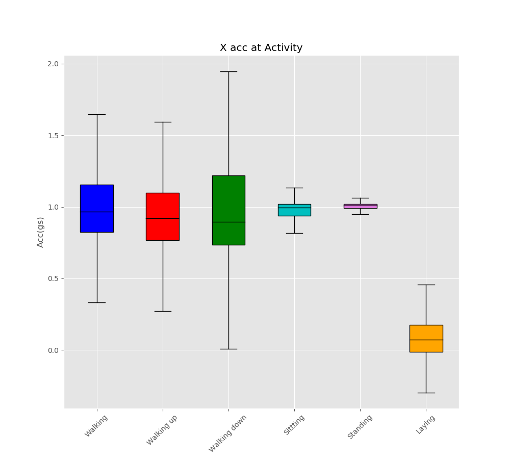

# Human Activity Recognition
## Background
The modern day smartphone is a pretty increadible piece of equipment that is fitteid with a wide range of sophisticated meatrument tools. and when it coms to sensor data, there are many ways to analyze that data. Being formally trained as an engineer, when I see acceleration data, I might take a different approach than a typical Data Scientist and in this project, I want to show the advantages that might hold. This projected uses a Uci data repository of smart phone data to label an activity the activities are outlined below, and I will show how a model can be imporoved by implementing spectrium analysis with statistics can aid in the classifiying of human activity. 
1. Walking           
2. Walking Upstairs  
3. Walking Downstairs
4. Sitting           
5. Standing          
6. Laying    
## The Data
The data was collected at 50 Hz for 30 subjects doing the previous 6 activities. Each experiment lasted approximetally 15 minutes and the data was manually labeled. This led to 1122773 rows of data. Each row of data contained accelration in the X,Y and Z direction as well as angular acclerations about XYZ. 

Note: The orientation of the phone was kept the same during all experiments but it is unclear in the data set which direction the XYZ axis were in relation to the phone. These pictures help as a contextual understanding of the acceleration directions but should not be used as an actual interpretation. 

  

## EDA

  

